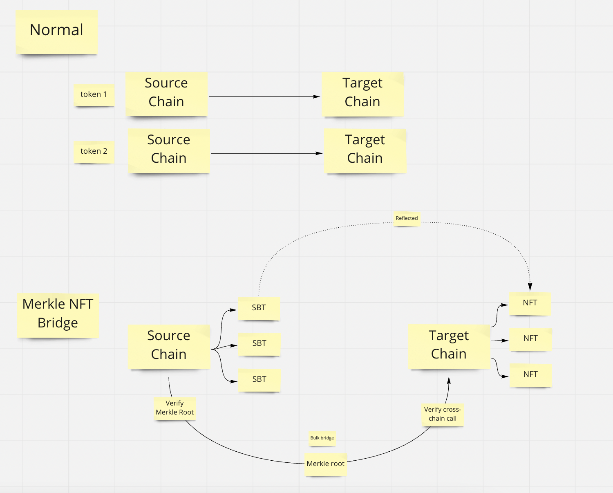

# Merkle NFT Bridge

## Inspiration

This is inspired by Uniswap token Airdrop using Merkle-tree verification for cost efficiency bridge.

And also MinterToken for the idea that "being NFT minter is fun and rewarded, and SBT can be used for it"

I combined this two into a Merkle NFT bridge.

This has merit for the Moonbeam can accept Ethereum chain payments, and distribute NFT in Moonbeam chain in very efficient way.

## What it does

Give SBT in the source chain in the initial user mint
Generate Merkle proof, verify it in the source chain, then transfer it to the target chain by Axelar.
User can claim or airdropped the NFT when the root is transferred to the target chain.

## Deployed Contract

https://ropsten.etherscan.io/address/0x01dB9dC55E3F4C490142E0a9d8eED9161bc07190#code

https://moonbase.moonscan.io/address/0xF02eb01aFF74e76991f79f3f13aBF0486d1Da803#code

## Cross-chain Messaging

https://testnet.axelarscan.io/gmp/0x86e84b1975bf219c8cb136375e83ae47591f26b6d2130fd3cb99dc595786764f

## Architecture



## Local

### Test

```
yarn //root
cd packages/contracts
yarn test
```

## Testnet

- need to set env DEPLOYER_PRIVATE_KEY first

```
yarn //root
cd packages/contracts
yarn hardhat run scripts/00_source.ts --network ropsten
// then update bridge.json source contract
yarn hardhat run scripts/01_target.ts --network ropsten
// then update bridge.json target contract
yarn hardhat run scripts/02_target.ts --network ropsten
// then check Axelar network bridge complete
// then set the root and proof in next script
yarn hardhat run scripts/03_mint.ts --network ropsten
```
